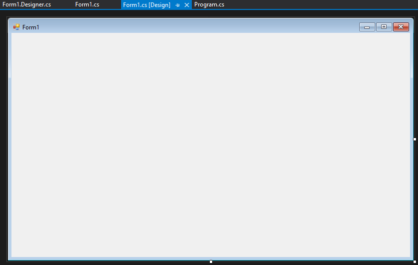

# Introduction

this is an introduction to all the basic things you need to know about windows forms.

## Setting up your project

The way you start a Windows Forms project is you open visual studio and press the Create a new project button.

Search for windows forms and select windows forms app.

Set the name of the project to whatever you want.

If it worked you should see this.

This is the designer here you can add and edit components of your window.

## Adding components to your form

You can see the components in the toolbox. Open the tool box (View > Toolbox of `Ctrl + W, X`) and search for button.

drag the button on to the designer and a button should appear on the form.

